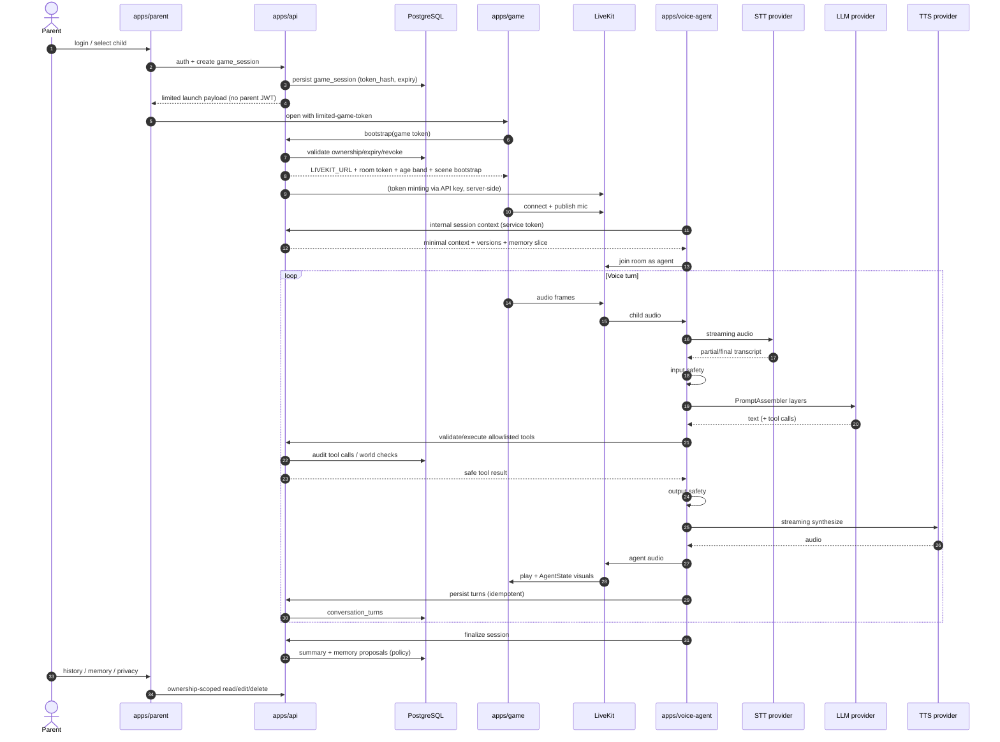

# Data-flow голосовой сессии

- Beads: pamagochi-eg9.2

## Trust notes

- Arrows carrying secrets stay server-side (API↔LiveKit credentials, Agent↔providers,
  Agent↔API service token).
- Game never receives provider keys or parent JWT.
- World mutations only via validated tool/request path through API/Phaser.
